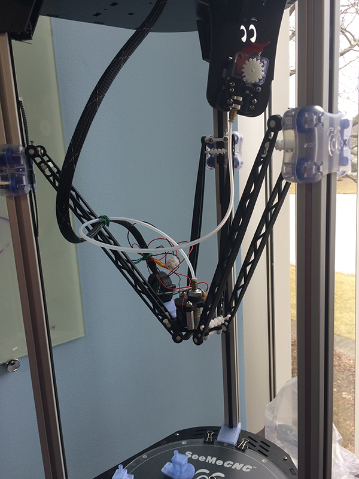
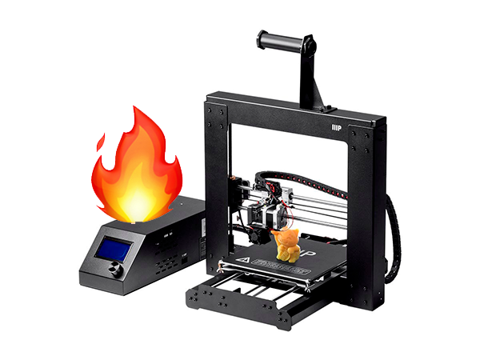
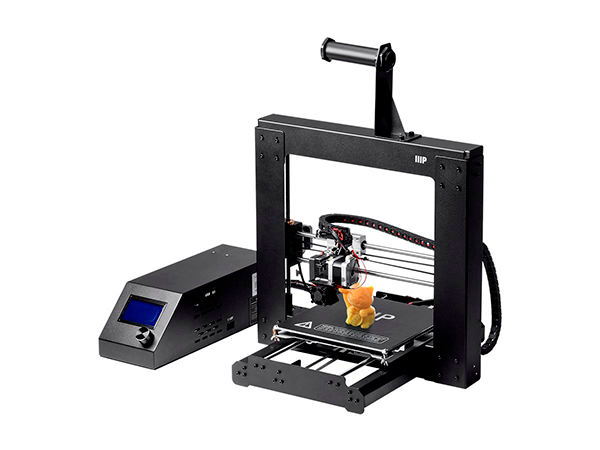

Shavetails
==========

/ˈSHāvˌtāl/

_noun_

1. a newly commissioned officer, especially a second lieutenant.
2. an inexperienced person.

This repository tracks our progress as a team of complete amateurs
trying to figure out how to kick ass at home-scale manufacturing
(3d-printing, CNC, die-cutting, etc.)

Meet the Team
-------------

[@jhunt](https://github.com/jhunt)

[@aanelli](https://github.com/aanelli)

[@daviddob](https://github.com/daviddob)

[@patjones](https://github.com/patjones)

Meet the Equipment
------------------

### Randy

### Earl

### Earl Jr.

The Projects
------------

### Wan Hao RepRap

### HeroQuest

### Benchmarks
